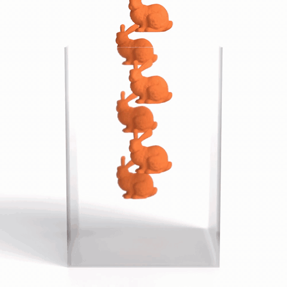
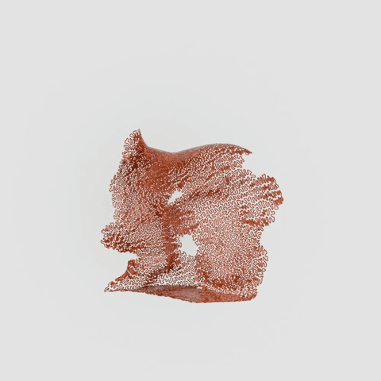

# Yet Another Symbolic Framework for Physical Simulation

## Paper
The low resolution version of the paper is available [here](https://raw.githubusercontent.com/txstc55/yasps/main/YASPS_compressed.pdf). A higher resolution paper is available on [arxiv](https://arxiv.org/pdf/2605.23088).

## Why YASPS
### No More Exponential Number of Functions
YASPS is a symbolic differentiation framework that tackles the simple problem: How do we write energies on meshes with collisions?

For example, a simple collision between two points is easy to write when each point can freely move around.

But what if some points can move around freely (it has 3 DoF), and the others are controlled by some rigid body (they all share the same 6 DoF).

What then? Do we write out all 4 combinations?
- Free-Free
- Free-Rigid
- Rigid-Rigid
- Rigid-Free

And what if there are 3 ways to control a points, what if I now write an energy with 4 points, which leads to 3^4=81 combinations?

YASPS says: no, just use the JOIN and UNION opeartor that YASPS introduces, and you only need to write the energy as one function.

And with those two operators, we can easily write simulations like those:

| Cage Deformation | Contact with Friction | Repulsive Curve |
|:---:|:---:|:---:|
|  |  |  |

### GPU by Default
YASPS generates all the code on GPU, and is very fast, so fast that we directly compared to hand optimized GPU simulation framework (table 1 in the paper), and we are still faster.

As long as you can write the energy correctly, you can trust YASPS to do the differentiation efficiently.

### CUDA and Metal

YASPS supports both CUDA and Apple Metal. Backend selection defaults to
Metal on macOS and CUDA on other platforms, or it can be set explicitly:

```bash
YASPS_BACKEND=metal python your_simulation.py
YASPS_BACKEND=cuda python your_simulation.py
```

The CUDA backend retains the original double-precision PyCUDA, C++,
Eigen, and CUDA path. The Metal backend uses float32 throughout because
Metal does not provide double precision. It translates the same symbolic
graphs into fused Metal source, compiles the generated translation units,
and dispatches them through the native Metal runtime. Sparse index
generation, Hessian assembly, block CG, LBVH collision detection, ACCD,
and GPUArray arithmetic remain GPU-resident.

Metal requires macOS with the Xcode command-line tools. The recorded M2
Max evaluation, including exact per-stage timings, logs, 120 frames, and
five videos, is in [metal_evaluation](metal_evaluation/README.md).

### CG Solver
YASPS already includes a conjugate gradient solver. It directly works with the Hessian and the gradient that YASPS computes, and gives you the solution of $$Hx = g$$. This is standard for Newton based minimizer.

## Install
Go to ./yasps directory and use the install script to install the package
```bash
cd yasps
./install.sh
```

## Examples
All the examples used in the paper are in the examples directory. 

## Documents
I will update with more instructions later on, I promise. 
